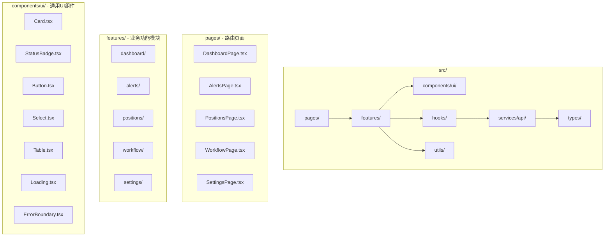

## 问题分析 (Current Issues)

### 1. 当前架构问题
- **Pages 与 Components 混合**: 页面级组件（如 `Dashboard`, `Alerts`）和 UI 组件（如 `Card`, `StatusBadge`）混在同一目录
- **业务逻辑耦合**: 页面组件内嵌大量业务逻辑（API 调用、状态管理、数据转换）
- **工具函数分散**: 格式化函数（如 `formatTime`, `formatDuration`）散落在各组件中，无法复用
- **类型定义集中**: 所有类型定义在单一文件，随着项目增长会变得难以维护

---

## 重构方案 (Proposed Architecture)



---

## 新目录结构

```
frontend/src/
├── pages/                          # 路由页面（薄层，只组装 features）
│   ├── DashboardPage.tsx
│   ├── AlertsPage.tsx
│   ├── PositionsPage.tsx
│   ├── WorkflowPage.tsx
│   ├── SettingsPage.tsx
│   └── index.ts
│
├── features/                       # 业务功能模块（核心业务逻辑）
│   ├── dashboard/
│   │   ├── components/
│   │   │   ├── AccountCard.tsx
│   │   │   ├── ServiceCard.tsx
│   │   │   ├── SummaryCard.tsx
│   │   │   └── index.ts
│   │   ├── hooks/
│   │   │   └── useDashboardData.ts
│   │   └── index.ts
│   │
│   ├── alerts/
│   │   ├── components/
│   │   │   ├── AlertsTable.tsx
│   │   │   ├── AlertsFilter.tsx
│   │   │   └── index.ts
│   │   ├── hooks/
│   │   │   └── useAlerts.ts
│   │   └── index.ts
│   │
│   ├── positions/
│   │   ├── components/
│   │   │   ├── PositionsTable.tsx
│   │   │   ├── HistoryTable.tsx
│   │   │   ├── PositionsTabs.tsx
│   │   │   └── index.ts
│   │   ├── hooks/
│   │   │   └── usePositions.ts
│   │   └── index.ts
│   │
│   ├── workflow/
│   │   ├── components/
│   │   │   ├── RunsList.tsx
│   │   │   ├── TimelineView.tsx
│   │   │   ├── SpanItem.tsx
│   │   │   ├── ChildItem.tsx
│   │   │   ├── ArtifactItem.tsx
│   │   │   └── index.ts
│   │   ├── hooks/
│   │   │   └── useWorkflow.ts
│   │   ├── utils/
│   │   │   └── workflowHelpers.ts   # getNodeDisplayName, getStatusColor 等
│   │   └── index.ts
│   │
│   └── settings/
│       ├── components/
│       │   ├── ConfigSection.tsx
│       │   ├── ConfigEditor.tsx
│       │   └── index.ts
│       ├── hooks/
│       │   └── useSettings.ts
│       └── index.ts
│
├── components/                     # 通用组件
│   ├── ui/                         # 基础 UI 组件
│   │   ├── Button.tsx
│   │   ├── Card.tsx
│   │   ├── Select.tsx
│   │   ├── Table.tsx
│   │   ├── StatusBadge.tsx
│   │   ├── Loading.tsx
│   │   ├── EmptyState.tsx
│   │   └── index.ts
│   │
│   └── layout/                     # 布局组件
│       ├── Layout.tsx
│       ├── Sidebar.tsx
│       ├── Header.tsx
│       ├── PageHeader.tsx
│       └── index.ts
│
├── hooks/                          # 全局通用 Hooks
│   ├── useWebSocket.ts
│   └── index.ts
│
├── services/                       # API 服务层
│   ├── api/
│   │   ├── client.ts               # axios 实例配置
│   │   ├── dashboard.ts            # Dashboard 相关 API
│   │   ├── alerts.ts               # Alerts 相关 API
│   │   ├── positions.ts            # Positions 相关 API
│   │   ├── workflow.ts             # Workflow 相关 API
│   │   ├── settings.ts             # Settings 相关 API
│   │   └── index.ts
│   └── index.ts
│
├── stores/                         # 全局状态管理
│   ├── appStore.ts
│   └── index.ts
│
├── types/                          # 类型定义（按领域拆分）
│   ├── common.ts                   # 通用类型
│   ├── dashboard.ts
│   ├── alerts.ts
│   ├── positions.ts
│   ├── workflow.ts
│   ├── settings.ts
│   └── index.ts
│
├── utils/                          # 通用工具函数
│   ├── formatters.ts               # formatTime, formatDuration, formatCurrency
│   ├── constants.ts                # 常量定义
│   └── index.ts
│
├── App.tsx
├── main.tsx
└── index.css
```

---

## 重构步骤

### Phase 1: 基础设施 (Infrastructure)
1. 创建 `utils/formatters.ts` - 提取通用格式化函数
2. 创建 `utils/constants.ts` - 提取常量
3. 拆分 `types/index.ts` 到领域文件
4. 拆分 `services/api.ts` 到领域文件

### Phase 2: UI 组件层 (UI Components)
5. 创建 `components/ui/` 目录，迁移并增强通用组件
6. 创建 `components/layout/` 目录，拆分 Layout 组件

### Phase 3: Features 模块 (Feature Modules)
7. 创建 `features/dashboard/` 模块
8. 创建 `features/alerts/` 模块
9. 创建 `features/positions/` 模块
10. 创建 `features/workflow/` 模块（最复杂，需拆分多个子组件）
11. 创建 `features/settings/` 模块

### Phase 4: Pages 层 (Pages Layer)
12. 创建 `pages/` 目录，创建薄页面组件
13. 更新 `App.tsx` 路由配置

### Phase 5: 清理 (Cleanup)
14. 删除旧的 `components/` 目录结构
15. 更新所有 import 路径

---

## 核心设计原则

| 原则 | 说明 |
|------|------|
| **Single Responsibility** | 每个模块只负责一个功能领域 |
| **Colocation** | 相关代码放在一起（组件、hooks、utils） |
| **Barrel Exports** | 每个目录提供 `index.ts` 统一导出 |
| **Custom Hooks** | 业务逻辑封装在 hooks 中，组件只负责渲染 |
| **Thin Pages** | 页面组件只做组装，不含业务逻辑 |

---

## 预期收益

1. **可维护性**: 按功能模块组织，易于定位和修改代码
2. **可复用性**: 通用组件和工具函数可跨模块复用
3. **可测试性**: 业务逻辑集中在 hooks，便于单元测试
4. **可扩展性**: 新增功能只需添加新的 feature 模块
5. **团队协作**: 不同开发者可并行开发不同 feature 模块
