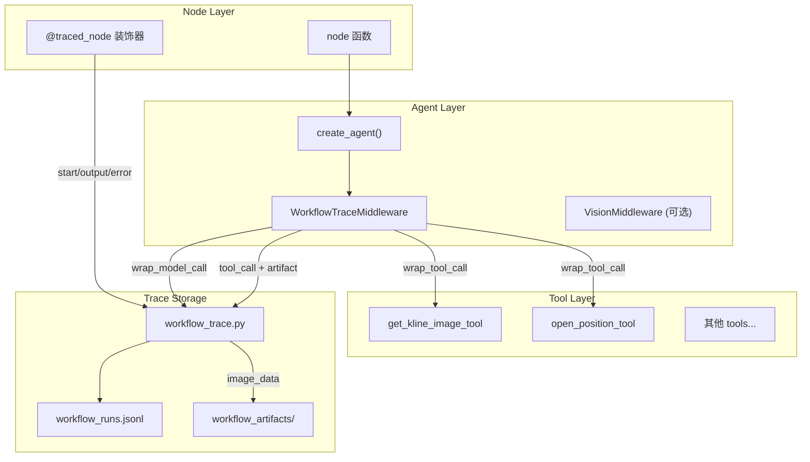

## 核心思路

1. **工具层不做 trace** - 所有 trace 逻辑收敛到 `WorkflowTraceMiddleware`
2. **中间件统一处理** - 通过 `wrap_tool_call` 和 `wrap_model_call` 捕获所有输入输出
3. **图像 artifact 自动保存** - 中间件检测到 `image_data` 字段时自动保存
4. **node 装饰器简化** - `@traced_node` 自动记录 start/output/error 事件

---

## 实施步骤

### 1. 扩展 WorkflowTraceMiddleware

在 [workflow_trace_middleware.py](file:///Users/bytedance/Desktop/crypto_agentx/backend/modules/agent/middleware/workflow_trace_middleware.py) 中：

**a) 添加 `wrap_model_call` / `awrap_model_call`**：
```python
def wrap_model_call(
    self,
    request: ModelRequest,
    handler: Callable[[ModelRequest], ModelResponse],
) -> ModelCallResult:
    call_time = datetime.now(timezone.utc).isoformat()
    response = handler(request)
    
    run_id = get_current_run_id()
    if run_id:
        record_model_call(run_id, self.node_name, {
            "timestamp": call_time,
            "messages_count": len(request.messages),
            "tools_count": len(request.tools),
            "response_content": response.result[0].content[:2000] if response.result else None,
            "tool_calls": [
                {"name": tc["name"], "args_keys": list(tc.get("args", {}).keys())}
                for tc in getattr(response.result[0], "tool_calls", []) or []
            ],
        })
    return response
```

**b) 增强 `wrap_tool_call` 自动保存图像 artifact**：
```python
def wrap_tool_call(self, request, handler):
    # ... 现有逻辑 ...
    
    # 自动检测并保存图像 artifact
    if tool_name == "get_kline_image" and run_id:
        self._save_image_artifact_from_output(run_id, tool_output)
    
    return result

def _save_image_artifact_from_output(self, run_id: str, tool_output: Any):
    """从工具输出中提取并保存图像 artifact"""
    try:
        data = json.loads(tool_output) if isinstance(tool_output, str) else tool_output
        if isinstance(data, dict) and data.get("image_data"):
            save_image_artifact(
                run_id,
                data.get("symbol", "unknown"),
                data.get("intervals", ["unknown"])[0] if data.get("intervals") else "unknown",
                data["image_data"],
            )
    except Exception:
        pass
```

---

### 2. 清理 get_kline_image_tool.py

移除工具内的 trace 代码：

```diff
- from modules.agent.utils.workflow_trace import get_current_run_id, save_image_artifact

- artifact = None
- run_id = get_current_run_id()
- if run_id:
-     artifact = save_image_artifact(run_id, symbol, interval, image_base64)

  return json.dumps({
      "success": True,
      "symbol": symbol,
      "intervals": [interval],
      "kline_count": limit,
      "image_data": image_base64,
      "feedback": feedback,
-     "artifact": artifact,
-     "run_id": run_id
  }, ensure_ascii=False)
```

---

### 3. 添加 record_model_call 函数

在 [workflow_trace.py](file:///Users/bytedance/Desktop/crypto_agentx/backend/modules/agent/utils/workflow_trace.py) 中添加：

```python
def record_model_call(run_id: str, node: str, model_record: Dict[str, Any], cfg: Optional[Dict[str, Any]] = None) -> None:
    event = {
        "type": "model_call",
        "run_id": run_id,
        "node": node,
        "ts": _now_iso(),
        "payload": _sanitize_payload(model_record, 2000),
    }
    append_event(event, cfg)
```

---

### 4. 创建 @traced_node 装饰器

新建 `modules/agent/utils/trace_decorators.py`：

```python
from functools import wraps
from typing import Callable, Dict, Any
from modules.agent.utils.workflow_trace import get_current_run_id, record_node_event

def traced_node(node_name: str):
    """
    装饰器：自动为 node 函数记录 start/output/error 事件
    """
    def decorator(func: Callable) -> Callable:
        @wraps(func)
        def wrapper(state, *args, **kwargs):
            run_id = get_current_run_id()
            config = kwargs.get("config") or (args[0] if args else None)
            if not run_id and config:
                run_id = config.get("configurable", {}).get("run_id")
            
            if run_id:
                record_node_event(run_id, node_name, "start", {})
            
            try:
                result = func(state, *args, **kwargs)
                if run_id:
                    record_node_event(run_id, node_name, "output", {
                        "result_keys": list(result.keys()) if isinstance(result, dict) else [],
                    })
                return result
            except Exception as e:
                if run_id:
                    record_node_event(run_id, node_name, "error", {"error": str(e)})
                raise
        return wrapper
    return decorator
```

---

### 5. 简化现有 node 代码

以 `single_symbol_analysis_node.py` 为例：

```python
from modules.agent.utils.trace_decorators import traced_node
from modules.agent.middleware.workflow_trace_middleware import WorkflowTraceMiddleware

@traced_node("single_symbol_analysis")
def single_symbol_analysis_node(state: AgentState, *, config: RunnableConfig) -> Dict[str, Any]:
    # 移除手动的 record_node_event 调用
    # ...
    
    middlewares = [
        VisionMiddleware(),  # 按需
        WorkflowTraceMiddleware("single_symbol_analysis"),
    ]
    
    subagent = create_agent(model=model, tools=tools, middleware=middlewares)
    # ...
```

---

## 架构图



---

## 文件变更清单

| 文件 | 操作 |
|------|------|
| `middleware/workflow_trace_middleware.py` | 添加 `wrap_model_call`，增强 `wrap_tool_call` 自动保存 artifact |
| `utils/workflow_trace.py` | 添加 `record_model_call()` |
| `utils/trace_decorators.py` | **新建** - `@traced_node` 装饰器 |
| `tools/get_kline_image_tool.py` | **移除** trace 相关代码 |
| `nodes/single_symbol_analysis_node.py` | 简化：使用装饰器，移除手动 trace |
| `nodes/position_management_node.py` | 简化：使用装饰器，移除手动 trace |
| `nodes/context_injection_node.py` | 简化：使用装饰器，移除手动 trace |
| `nodes/reporting_node.py` | 简化：使用装饰器，移除手动 trace |

---

## 新增 tool/node 时的集成方式

**新增 Tool**：无需任何 trace 代码，中间件自动记录

**新增 Node**：
```python
@traced_node("my_new_node")
def my_new_node(state, *, config):
    middlewares = [WorkflowTraceMiddleware("my_new_node")]
    agent = create_agent(model=model, tools=tools, middleware=middlewares)
    # ...
```

如果确认，我将按此方案实现。