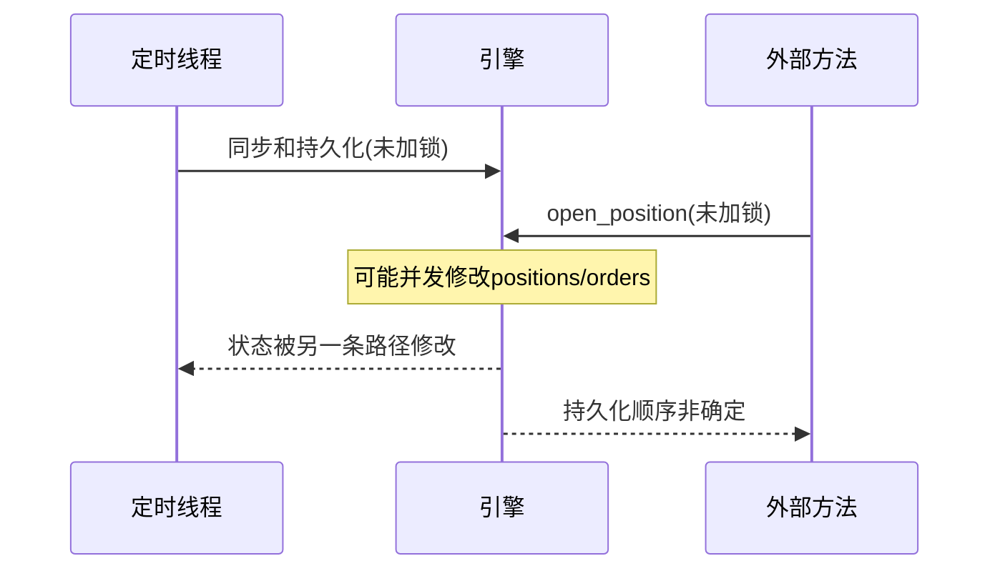
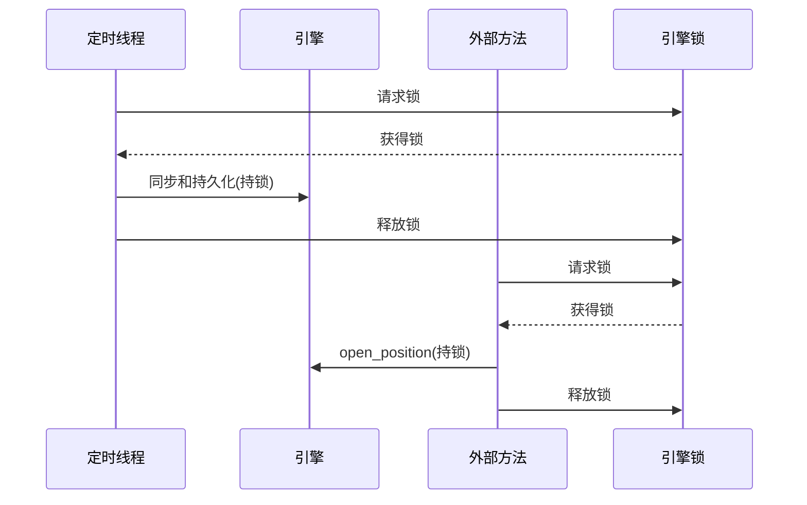

# 1. 问题

引擎的定时同步线程与部分公开方法（尤其是 `open_position`）在未持有引擎锁（`self._lock`）的情况下访问和修改共享状态（`positions`、`orders`、持久化），而其他方法（如 `start`/`stop`/`update_tp_sl`/`close_position`）统一使用了锁，导致锁使用不一致与并发风险。

## 1.1. **定时同步线程未统一加锁访问共享状态**

- 位置：`agent/live_engine/engine.py` 183-207 行（`_periodic_sync_loop`）
- 现状：循环中执行 `sync_tpsl_orders()`、`sync_from_api()`、`cleanup_orphan_orders()`、`validate_tpsl_consistency()`、`state_writer.persist()` 等操作，这些会读取或修改引擎共享状态，但未在引擎级锁保护下。

```python
# 现状（节选）
while self._running:
    time.sleep(sync_interval)
    ...
    self.order_service.sync_tpsl_orders()
    self.position_service.sync_from_api()
    self.account_service.sync_from_api()
    active_symbols = set(self.position_service.positions.keys())
    cleaned = self.order_service.cleanup_orphan_orders(active_symbols)
    self.order_service.validate_tpsl_consistency(self.position_service.positions)
    self._inject_tpsl_into_positions()
    self.state_writer.persist()
```

- 问题：与外部方法同时操作同一份状态（例如迭代 `positions` 期间被修改）可能导致竞态条件、状态撕裂或偶发异常；在 `stop()` 持久化阶段也可能出现不一致。

## 1.2. **`open_position` 未加锁导致状态撕裂**

- 位置：`agent/live_engine/engine.py` 254-329 行（`open_position`）
- 现状：方法内部在未持锁时读取与写入共享状态，并在成功后进行持久化。

```python
# 现状（节选）
result = self.order_service.open_position_with_tpsl(...)
if 'error' not in result:
    self.position_service.sync_from_api()  # 写入共享状态
    if symbol in self.position_service.positions:
        pos = self.position_service.positions[symbol]
        pos.tp_price = tp_price
        pos.sl_price = sl_price
        pos.leverage = leverage
    self.state_writer.persist()            # 持久化共享状态
```

- 问题：与定时线程或其他持锁方法并发更新同一份状态，造成数据不一致或处理顺序非确定；对外接口行为看似正确，但内部状态可能出现“成功但未记录”或“覆盖更新”。

## 1.3. **持久化在未加锁路径被调用**

- 位置：`_periodic_sync_loop` 与 `open_position` 中的 `self.state_writer.persist()`
- 现状：持久化调用既出现在持锁方法（`start`/`stop`/`update_tp_sl`/`close_position`），也出现在未持锁路径，导致同一持久化文件/记录的并发写入风险。

```python
# 未持锁的持久化调用
self.state_writer.persist()
```

- 问题：并发持久化可能导致写入顺序不确定、部分写入丢失，或在写入过程中读取到半更新状态。

# 2. 收益

统一在涉及共享状态的操作中获取引擎级锁，可显著降低并发风险，避免状态撕裂与非确定性错误，提升稳定性与排障可预期性。

## 2.1. **状态一致性提升**

- 在引擎层串行化共享状态写入（`positions`、`orders`、持久化），避免“读-改-写”期间被并发打断。
- 预计“未持锁的共享状态更新点”从 **2** 处减少到 **0** 处（定时线程与 `open_position`）。

## 2.2. **稳定性与可预期性提升**

- 减少迭代期间被修改、非确定性持久化顺序、偶发 KeyError 等并发症状。
- 停止阶段（`stop`）与定时线程退出的行为更可控，降低偶发报错概率。

## 2.3. **排障与回归成本降低**

- 并发相关的隐蔽问题减少，日志与状态更连贯，定位问题更直接。
- 相关回归测试用例数量与复杂度下降（不再需要覆盖多种并发交叉时序）。

# 3. 方案

总体思路：在所有涉及共享状态读写与持久化的路径统一使用引擎级锁（`self._lock`）。短期先以“全路径加锁”的方式确保安全；中期再优化锁粒度，将耗时 IO 置于锁外，锁内只进行状态合并与持久化。

## 3.1. **定时同步线程加锁：解决“定时同步线程未统一加锁访问共享状态”**

- 方案概述：在 `_periodic_sync_loop` 的关键段使用 `with self._lock:` 包裹状态读取、变更与持久化，保证与外部方法串行化。
- 实施步骤：
  - 将 `sync_tpsl_orders()`、`position_service.sync_from_api()`、`account_service.sync_from_api()` 与后续清理、校验、持久化统一置于引擎锁内。
  - 可保留 `sleep` 与早期退出检查在锁外，避免长时间占用锁。

```python
# 修改前（节选）
self.order_service.sync_tpsl_orders()
self.position_service.sync_from_api()
self.account_service.sync_from_api()
...  # 清理、校验
self._inject_tpsl_into_positions()
self.state_writer.persist()

# 修改后（建议实现）
with self._lock:
    self.order_service.sync_tpsl_orders()
    self.position_service.sync_from_api()
    self.account_service.sync_from_api()

    active_symbols = set(self.position_service.positions.keys())
    cleaned = self.order_service.cleanup_orphan_orders(active_symbols)
    if cleaned > 0:
        logger.info(f"定时清理: 已清除 {cleaned} 个币种的孤儿订单")

    self.order_service.validate_tpsl_consistency(self.position_service.positions)
    self._inject_tpsl_into_positions()
    self.state_writer.persist()
```

- 说明：短期内即使将外部 API 拉取置于锁内，影响主要是阻塞其他外部调用；考虑到同步间隔与外部接口调用时长可控，该折衷在可靠性上收益更大。中期可以在服务层拆分“拉取”与“应用”，实现“锁外拉取、锁内应用”。

### 序列图（当前 vs 目标）



上述图展示了当前并发下的两个路径都未持锁，容易发生交叉写入。需要关注的是 "未加锁的状态修改" 这条隐患路径。



该图展示了目标形态：所有共享状态更新路径均通过引擎锁串行化，消除了交叉写入与非确定性持久化顺序。

## 3.2. **为 `open_position` 加锁：解决“open_position 未加锁导致状态撕裂”**

- 方案概述：为 `open_position` 的关键段引入 `with self._lock:`，统一对共享状态的写入与持久化进行保护。
- 实施步骤（两种可选粒度）：
  - 简单安全版：方法整体持锁，最小改动即可保证串行化；
  - 优化版：将耗时的行情与下单请求置于锁外，仅在“同步持仓、修改 `pos`、持久化与构造返回值”阶段加锁。

```python
# 简单安全版（方法整体持锁）
def open_position(...):
    with self._lock:
        # 原有计算、下单、同步、写入、持久化逻辑保持不变
        ...

# 优化版（锁内仅包含共享状态修改）
def open_position(...):
    # 1) 锁外：行情与数量计算、下单
    ticker = self.rest_client.get_24hr_ticker(symbol)
    ...
    result = self.order_service.open_position_with_tpsl(...)

    # 2) 锁内：同步持仓、更新 pos、持久化与返回值构造
    if 'error' not in result:
        with self._lock:
            self.position_service.sync_from_api()
            if symbol in self.position_service.positions:
                pos = self.position_service.positions[symbol]
                pos.tp_price = tp_price
                pos.sl_price = sl_price
                pos.leverage = leverage
                self._inject_tpsl_into_positions()
                self.state_writer.persist()
                return { 'success': True, ... }
            else:
                self.state_writer.persist()
                return { 'success': True, 'symbol': symbol, ... }
    return result
```

- 说明：推荐先落地“简单安全版”，快速消除竞态；随后在服务层支持“锁外拉取、锁内应用”的接口，再过渡到“优化版”以缩短锁持有时间。

## 3.3. **统一持久化调用策略：解决“持久化在未加锁路径被调用”**

- 方案概述：约定所有持久化写入（`state_writer.persist()` / `persist_sync()`）均需在持锁上下文中执行；将零散的未持锁持久化点收敛到统一规范。
- 实施步骤：
  - 在 `_periodic_sync_loop` 与 `open_position` 中的持久化调用前加 `with self._lock:`；
  - 在代码评审与单测中增加持久化调用的锁规范检查。

# 4. 回归范围

本次变更涉及引擎层的并发控制，对“启动-交易-定时同步-停机”全链路的时序与状态一致性有影响。需从端到端业务流程视角回归，重点关注“共享状态在不同路径上的串行化”。

## 4.1. 主链路

- 正常流程：
  - 引擎启动 -> 初始同步与持久化 -> 定时线程运行 -> 开仓 -> 更新 TP/SL -> 平仓 -> 引擎停止 -> 同步持久化。
- 重点关注点：
  - 开仓与定时线程在同一时间片发生时，`positions` 是否保持一致，持久化是否记录最新值；
  - `stop()` 期间定时线程是否能顺利退出并完成最终持久化；
  - `update_tp_sl()` 与定时线程的相互时序是否会出现覆盖或丢失。
- 示例用例（自然语言描述）：
  - 用例 A：在定时线程执行到“清理孤儿订单”时触发一次 `open_position`，期望：`positions` 与 `orders` 一致，持久化只记录一次且为最新状态。
  - 用例 B：`stop()` 被调用后 500ms 内，再次触发定时线程轮次，期望：定时线程检测到 `_running=False` 并退出，最终持久化成功。

## 4.2. 边界情况

- 并发交叉：开仓成功但 `positions` 尚未同步时，定时线程同时执行一次同步，期望：最终状态一致且无异常；
- 异常场景：`open_position` 下单成功、后续同步抛异常，期望：锁内异常不会污染全局状态，持久化仍保证不写入半成品；
- 资源约束：连续高频触发 `open_position` 与定时线程，观察锁竞争对延迟的影响是否在接受范围内。


该图概述了主链路，并强调“定时线程与外部方法”的并发在目标形态下被锁串行化处理。测试时需验证在各节点间不会出现状态撕裂。
