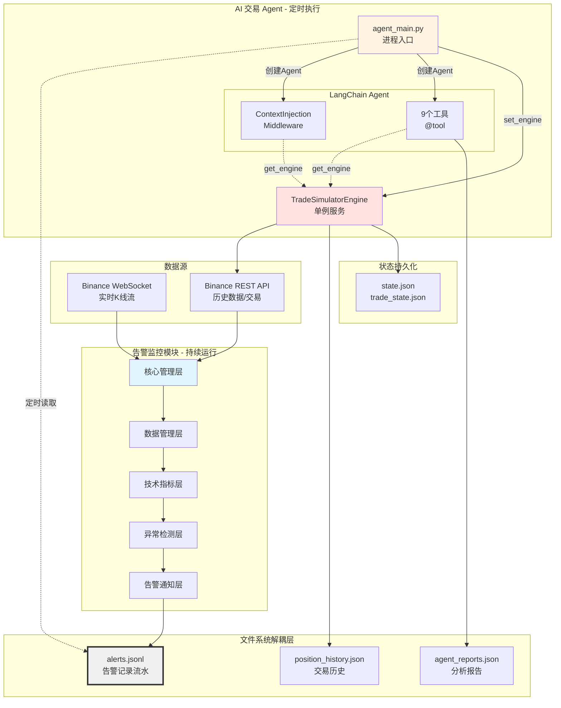
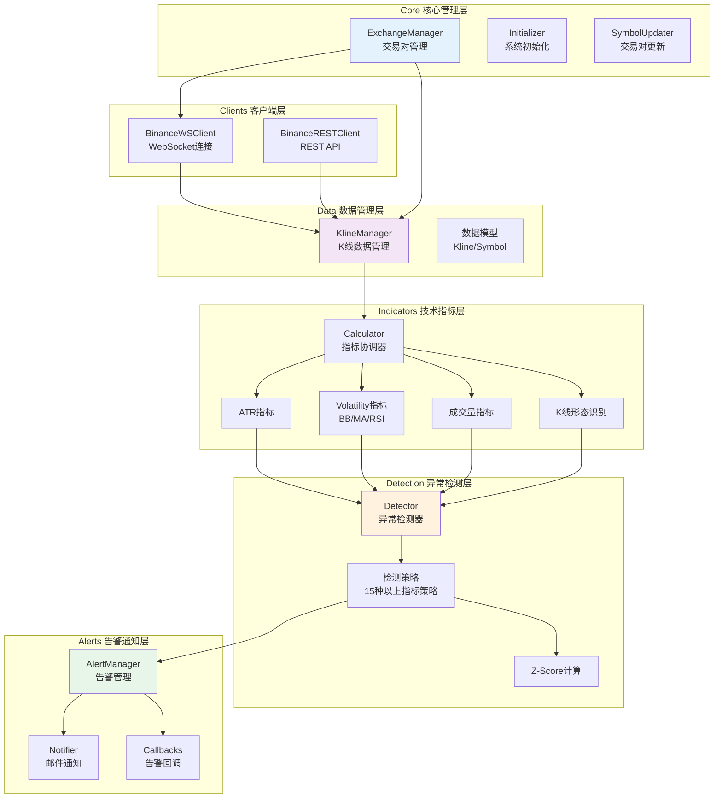
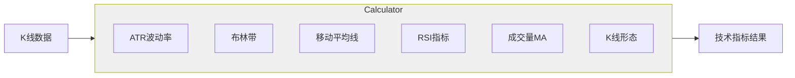
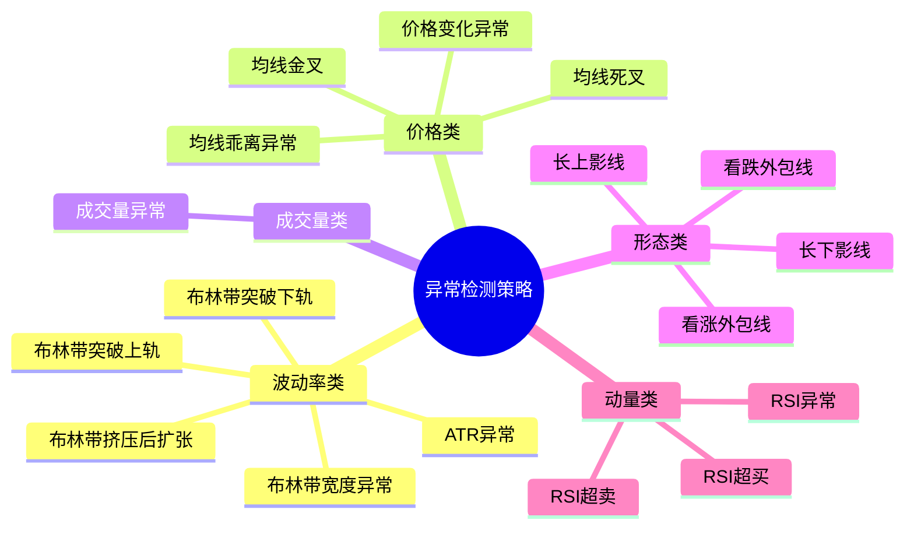
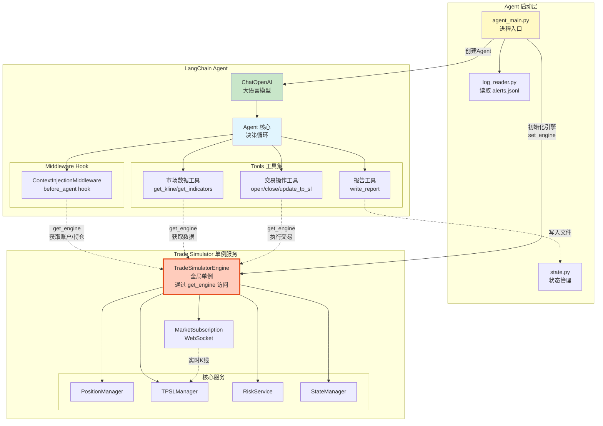
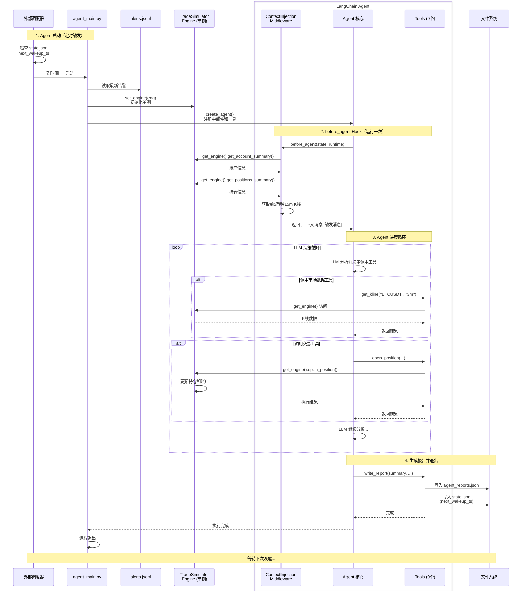
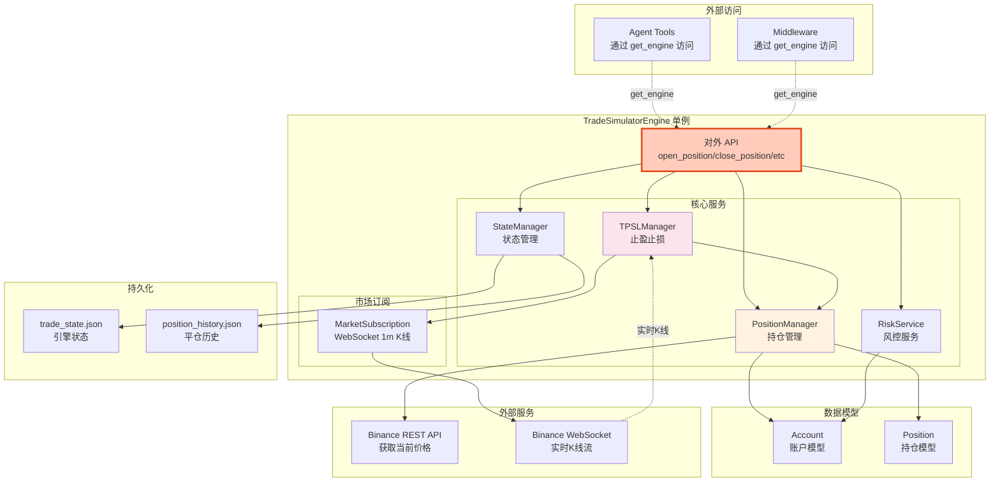
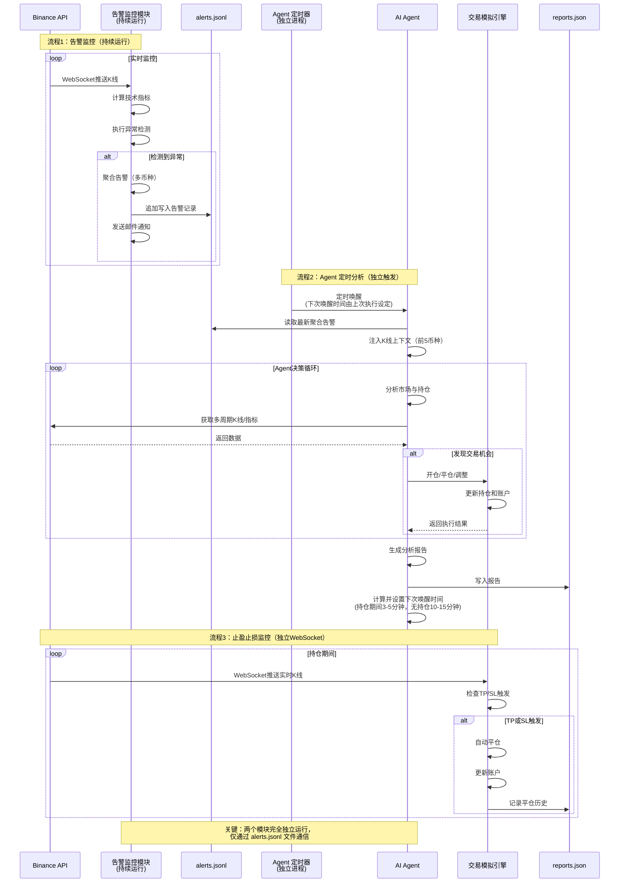
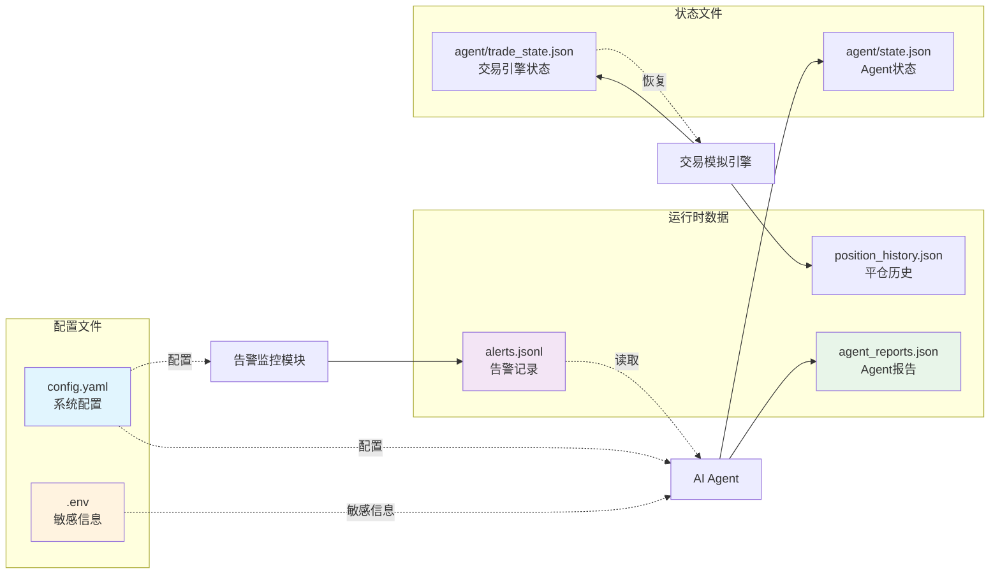
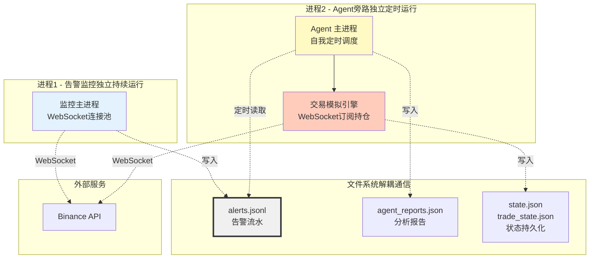

# 加密货币交易监控与自动化交易系统架构

## 系统概览

本系统由两个**独立运行**的模块组成：
1. **告警监控模块**：实时监控市场异常波动
2. **AI 交易 Agent**：定时分析并执行模拟交易

两个模块通过**文件系统**解耦通信，互不依赖。

### 核心组成



**架构特点：**

**模块间通信：**
- 🔄 **告警模块**：持续运行，实时监控，写入 `alerts.jsonl`
- ⏰ **Agent 模块**：定时执行，读取 `alerts.jsonl`，独立决策
- 📁 **文件解耦**：两个模块通过文件系统通信，互不阻塞

**Agent 内部架构：**
- 🎯 **LangChain Agent**：包含 Middleware 和 Tools
- 🔗 **单例服务**：TradeSimulatorEngine 通过 `get_engine()` 被访问
- 🛠️ **解耦设计**：Tools 和 Middleware 通过单例模式访问引擎，无直接依赖

---

## 1. 告警监控模块 (src/)

### 1.1 整体架构



### 1.2 核心模块详解

#### Core 核心管理层

| 模块 | 文件 | 职责 |
|------|------|------|
| **ExchangeManager** | `exchange_manager.py` | • 管理活跃交易对列表<br/>• 协调 WebSocket 连接<br/>• 启动/停止监控流程 |
| **Initializer** | `initializer.py` | • 系统启动初始化<br/>• 预热历史数据<br/>• 配置加载验证 |
| **SymbolUpdater** | `symbol_updater.py` | • 定时更新交易对列表<br/>• 过滤低成交量币种<br/>• 处理交易对变更 |

#### Data 数据管理层

| 模块 | 文件 | 职责 |
|------|------|------|
| **KlineManager** | `kline_manager.py` | • 维护 K 线数据缓存<br/>• 处理实时 K 线更新<br/>• 提供历史数据查询接口 |
| **Models** | `models.py` | • 定义 Kline 数据模型<br/>• 定义 Symbol 数据模型<br/>• 提供数据序列化方法 |

#### Indicators 技术指标层



| 模块 | 文件 | 支持的指标 |
|------|------|-----------|
| **ATR** | `atr.py` | • ATR（平均真实波幅）<br/>• ATR Z-Score |
| **Volatility** | `volatility.py` | • 布林带（BB）<br/>• 布林带宽度<br/>• EMA 快线/慢线<br/>• MA 乖离度<br/>• RSI 及其 Z-Score |
| **Volume** | `volume.py` | • 成交量移动平均<br/>• 成交量 Z-Score |
| **Pattern** | `pattern.py` | • 外包线识别（看涨/看跌）<br/>• 长上影线/长下影线 |
| **Calculator** | `calculator.py` | • 指标计算协调器<br/>• 批量计算接口 |

#### Detection 异常检测层

**支持的 15+ 种检测策略：**



| 模块 | 文件 | 职责 |
|------|------|------|
| **Detector** | `detector.py` | • 协调所有检测策略<br/>• 计算异常等级（1-5）<br/>• 生成告警条目 |
| **Strategies** | `strategies.py` | • 实现具体检测逻辑<br/>• 阈值判断<br/>• 指标组合分析 |
| **ZScore** | `zscore.py` | • Z-Score 标准化计算<br/>• 滚动窗口统计<br/>• 异常值识别 |

#### Alerts 告警通知层

| 模块 | 文件 | 职责 |
|------|------|------|
| **AlertManager** | `manager.py` | • 聚合多币种告警<br/>• 按时间窗口批量处理<br/>• 写入 alerts.jsonl |
| **Notifier** | `notifier.py` | • SMTP 邮件发送<br/>• 告警内容格式化<br/>• 失败重试机制 |
| **Callbacks** | `callbacks.py` | • K 线回调处理<br/>• 触发异常检测流程 |

---

## 2. AI 交易 Agent (agent/)

### 2.1 整体架构



**架构说明：**

1. **Agent 启动层**：
   - `agent_main.py`：进程入口，初始化引擎和 Agent
   - 读取 `alerts.jsonl` 获取市场信息
   - 创建 TradeSimulatorEngine 并设为全局单例

2. **LangChain Agent**：
   - 通过 `create_agent()` 创建
   - 包含 Middleware（before_agent hook）
   - 包含 9 个工具（Tools）
   - Agent 核心负责决策循环

3. **Trade Simulator 单例**：
   - 独立的服务层
   - 通过 `get_engine()` 被访问
   - 管理所有交易相关逻辑

### 2.2 核心流程

#### Agent 执行流程



**流程关键点：**

| 阶段 | 说明 |
|------|------|
| **启动** | `agent_main.py` 初始化引擎并创建 LangChain Agent |
| **before_agent** | Middleware 通过 `get_engine()` 构造初始上下文 |
| **决策循环** | Agent 核心反复调用 Tools，Tools 通过 `get_engine()` 访问引擎 |
| **报告生成** | `write_report` 工具写入文件并设置下次唤醒时间 |
| **退出** | 进程结束，等待调度器下次启动 |

### 2.3 模块详解

#### Agent 主控层

| 模块 | 文件 | 职责 |
|------|------|------|
| **agent_main** | `agent_main.py` | • 系统入口点（独立进程）<br/>• 通过 `log_reader` 读取 `/data/alerts.jsonl`<br/>• 创建 LangChain Agent<br/>• 初始化工具和中间件<br/>• 执行完成后设置下次唤醒时间并退出 |
| **state** | `state.py` | • 管理 Agent 状态（`state.json`）<br/>• 存储下次唤醒时间戳<br/>• 运行历史记录 |
| **log_reader** | `log_reader.py` | • 读取 `data/alerts.jsonl` 文件<br/>• 解析最新的聚合告警记录<br/>• 为 Agent 提供市场异常信息 |

#### Middleware 中间件层

**ContextInjectionMiddleware** (`middleware/context_injection_middleware.py`)

> LangChain AgentMiddleware 的实现，在 `create_agent()` 时注册

**工作机制：**

```python
class ContextInjectionMiddleware(AgentMiddleware):
    def before_agent(self, state, runtime):
        # 1. 通过 get_engine() 获取账户和持仓摘要
        account_summary = get_engine().get_account_summary()
        positions_summary = get_engine().get_positions_summary()
        
        # 2. 读取告警数据并排序
        # 3. 为前5个币种调用 BinanceRestClient 获取15分钟K线
        # 4. 构造结构化上下文消息
        # 5. 注入 HumanMessage 到 Agent 对话开始
        
        return {"messages": [context_msg, trigger_msg]}
```

**功能特点：**
- 🎯 **before_agent hook**：在 Agent 执行前运行一次
- 📊 **预加载数据**：前5个优先级币种的15根K线
- 🔗 **单例访问**：通过 `get_engine()` 获取账户/持仓信息
- ⚡ **性能优化**：减少 Agent 初始工具调用，加快首次决策

**优势：**
| 优势 | 说明 |
|------|------|
| 减少工具调用 | Agent 启动时已有完整上下文，无需多次调用 get_kline |
| 完整初始信息 | 账户状态 + 持仓详情 + 前5币种K线一次性注入 |
| 加快决策速度 | 跳过数据收集阶段，直接进入分析决策 |

#### Tools 工具集

> 所有工具都是通过 `@tool` 装饰器定义，在 `create_agent()` 时注册到 Agent

**工具访问模式：**

```python
# 工具内部通过单例访问 TradeSimulatorEngine
from agent.trade_simulator import get_engine

@tool("open_position")
def open_position_tool(symbol: str, side: str, notional_usdt: float, ...):
    eng = get_engine()  # 获取全局单例
    result = eng.open_position(...)  # 调用引擎方法
    return result
```

**9 个工具分类：**

**1. 市场数据工具** (`tools/`)

| 工具 | 文件 | 功能 | 数据来源 |
|------|------|------|---------|
| **get_kline** | `get_kline_tool.py` | 获取K线数据（3m/15m/1h/4h） | BinanceRestClient |
| **get_indicators** | `get_indicators_tool.py` | 计算技术指标（ATR/RSI/EMA/BB等） | BinanceRestClient + 本地计算 |
| **get_account** | `get_account_tool.py` | 获取账户摘要（余额/权益/保证金利用率） | `eng.get_account_summary()` |
| **get_positions** | `get_positions_tool.py` | 获取当前持仓列表 | `eng.get_positions_summary()` |

**2. 交易操作工具** (`tools/`)

| 工具 | 文件 | 功能 | 引擎方法 |
|------|------|------|---------|
| **open_position** | `open_position_tool.py` | 开仓/加仓，支持百分比TP/SL | `eng.open_position()` |
| **close_position** | `close_position_tool.py` | 全平仓 | `eng.close_position()` |
| **update_tp_sl** | `update_tp_sl_tool.py` | 更新持仓的止盈止损价格 | `eng.update_tp_sl()` |

**3. 报告工具** (`tools/`)

| 工具 | 文件 | 功能 | 输出 |
|------|------|------|------|
| **write_report** | `write_report_tool.py` | 生成分析报告并设置下次唤醒时间 | `agent_reports.json` + `state.json` |
| **send_email** | `send_email_tool.py` | 发送邮件通知 | SMTP |

#### Trade Simulator 交易模拟引擎

> 独立的单例服务，通过 `get_engine()` 被 Tools 和 Middleware 访问

**单例模式实现：**

```python
# agent/trade_simulator/__init__.py
_engine: Optional[TradeSimulatorEngine] = None

def set_engine(engine: TradeSimulatorEngine) -> None:
    """在 agent_main.py 启动时调用一次"""
    global _engine
    _engine = engine

def get_engine() -> Optional[TradeSimulatorEngine]:
    """工具和中间件通过此方法访问引擎"""
    return _engine
```

**架构设计：**



**关键特点：**
- ✅ **全局单例**：整个 Agent 进程共享一个引擎实例
- 🔗 **解耦访问**：工具通过 `get_engine()` 访问，无直接依赖
- 📊 **状态持久化**：支持中断恢复（trade_state.json）
- ⚡ **实时监控**：WebSocket 订阅持仓币种的实时价格

**核心服务详解：**

| 服务 | 文件 | 职责 |
|------|------|------|
| **TradeSimulatorEngine** | `simulator.py` | • 协调所有服务<br/>• 提供统一API<br/>• 管理生命周期 |
| **PositionManager** | `position_manager.py` | • 开仓/加仓逻辑<br/>• 平仓逻辑<br/>• 保证金计算<br/>• 持仓汇总 |
| **TPSLManager** | `tpsl_manager.py` | • 监听实时K线<br/>• 检测止盈止损触发<br/>• 自动平仓执行<br/>• 更新TP/SL价格 |
| **RiskService** | `risk_service.py` | • 手续费计算<br/>• 账户权益标记<br/>• 保证金检查<br/>• 百分比归一化 |
| **StateManager** | `state_manager.py` | • 状态恢复<br/>• 状态持久化<br/>• 操作日志记录<br/>• 平仓历史归档 |
| **MarketSubscription** | `market_subscription.py` | • WebSocket订阅管理<br/>• 实时K线推送<br/>• 重连机制 |

**数据模型：**

```python
# Account（账户模型）
{
    "balance": 10000.0,        # 余额
    "equity": 10100.0,         # 权益
    "realized_pnl": 100.0,     # 已实现盈亏
    "unrealized_pnl": 50.0,    # 未实现盈亏
    "reserved_margin_sum": 500.0,  # 已用保证金
    "positions_count": 2,      # 持仓数量
    "margin_usage_rate": 5.0   # 保证金利用率（%）
}

# Position（持仓模型）
{
    "id": "abc123",            # 持仓ID
    "symbol": "BTCUSDT",       # 交易对
    "side": "long",            # 方向（long/short）
    "qty": 0.1,                # 数量
    "entry_price": 50000.0,    # 入场价
    "tp_price": 51000.0,       # 止盈价
    "sl_price": 49500.0,       # 止损价
    "leverage": 5,             # 杠杆倍数
    "notional_usdt": 5000.0,   # 名义价值
    "margin_used": 1000.0,     # 占用保证金
    "status": "open",          # 状态（open/closed）
    "unrealized_pnl": 100.0,   # 未实现盈亏
    "roe": 0.10                # 收益率
}
```

---

## 3. 数据流图

### 3.1 两个独立模块的完整数据流



### 3.2 配置与状态文件关系



---

## 4. 关键特性

### 4.1 架构设计特性

| 特性 | 说明 | 优势 |
|------|------|------|
| **完全解耦** | 监控模块和 Agent 模块通过文件系统通信 | • 互不影响，独立部署<br/>• Agent 崩溃不影响监控<br/>• 可以单独测试和升级 |
| **独立进程** | 两个模块运行在不同的进程中 | • 资源隔离<br/>• 便于横向扩展<br/>• 故障隔离 |
| **自我定时** | Agent 自己决定下次唤醒时间 | • 根据持仓情况动态调整<br/>• 无需外部复杂调度逻辑<br/>• 更灵活的执行频率 |
| **文件通信** | 使用 JSONL 格式的流水文件 | • 简单可靠<br/>• 易于调试和审计<br/>• 支持多读者模式 |

### 4.2 告警监控模块特性

| 特性 | 说明 |
|------|------|
| **实时监控** | WebSocket 连接，毫秒级 K 线更新 |
| **多维度检测** | 15+ 种技术指标和形态识别策略 |
| **智能过滤** | Z-Score 标准化，减少误报 |
| **批量聚合** | 按时间窗口聚合多币种告警 |
| **自动通知** | SMTP 邮件实时告警 |
| **动态交易对** | 自动更新活跃交易对列表 |
| **持续运行** | 7×24 小时不间断监控 |

### 4.3 AI Agent 特性

| 特性 | 说明 |
|------|------|
| **旁路设计** | 独立于监控系统，读取告警文件 |
| **自我调度** | 根据持仓情况动态设置执行间隔 |
| **多周期分析** | 支持 3m/15m/1h/4h 多时间框架 |
| **上下文预注入** | 减少工具调用，加快决策 |
| **动态仓位管理** | 根据信号强度和风险动态计算仓位 |
| **保证金利用率监控** | 实时监控资金使用效率 |
| **完整报告** | 每次分析生成详细报告 |
| **状态持久化** | 支持中断恢复 |

### 4.4 交易模拟引擎特性

| 特性 | 说明 |
|------|------|
| **全仓保证金** | 模拟真实交易环境 |
| **实时止盈止损** | WebSocket 监听，自动触发 |
| **手续费模拟** | Taker 0.05% 手续费 |
| **持仓管理** | 支持加仓、减仓、更新TP/SL |
| **风控服务** | 保证金检查、权益标记 |
| **历史归档** | 完整记录每笔交易 |

---

## 5. 技术栈

### 后端技术

| 技术 | 用途 |
|------|------|
| **Python 3.11+** | 主要编程语言 |
| **LangChain** | AI Agent 框架 |
| **OpenAI API** | 大语言模型（可配置其他模型） |
| **NumPy/Pandas** | 数据处理和计算 |
| **WebSocket** | 实时数据流 |
| **SMTP** | 邮件通知 |

### 数据存储

| 类型 | 格式 | 用途 |
|------|------|------|
| **配置** | YAML + .env | 系统配置和敏感信息 |
| **告警** | JSONL | 告警流水记录 |
| **报告** | JSON | Agent 分析报告 |
| **状态** | JSON | 系统状态持久化 |
| **历史** | JSON | 交易历史归档 |

### 外部依赖

| 服务 | 用途 |
|------|------|
| **Binance API** | 行情数据和交易接口 |
| **SMTP 服务器** | 邮件发送 |
| **OpenAI API** | LLM 服务（或其他兼容服务） |

---

## 6. 部署架构

### 6.1 进程模型



**关键特点：**
- ✅ **完全解耦**：两个进程独立运行，互不依赖
- 📁 **文件通信**：通过 `alerts.jsonl` 单向传递信息
- 🔄 **各自循环**：监控持续监听，Agent 自我定时

### 6.2 运行模式

#### 进程1：告警监控模块
```bash
# 启动方式
python main.py  # 或使用 systemd 守护进程

# 运行特点
- 持续运行，不退出
- 监听多个交易对的实时 K 线
- 检测到异常 → 写入 alerts.jsonl
- 独立的邮件通知流程
```

#### 进程2：AI Agent 旁路
```bash
# 启动方式（通常用 cron 或 systemd timer）
python agent/agent_main.py

# 运行特点
- 单次执行完成后自动退出
- 读取 alerts.jsonl 获取市场信息
- 完成分析后写入 agent_reports.json
- 在 state.json 中记录下次唤醒时间
- 由外部调度器根据下次唤醒时间重新启动
```

**定时调度示例（crontab）：**
```bash
# 检查 state.json 中的 next_wakeup_ts，到时间则执行
*/1 * * * * /path/to/check_and_run_agent.sh
```

#### 交易模拟引擎
```
- 随 Agent 进程启动和退出
- Agent 执行期间持续监听持仓的实时价格
- 自动执行止盈止损（写入历史记录）
- Agent 退出前持久化状态到 trade_state.json
```

---

## 7. 配置管理

### 配置文件结构

```
config/
├── config.yaml          # 主配置文件（非敏感）
├── settings.py          # 配置加载器
└── README.md           # 配置说明文档

.env                     # 环境变量（敏感信息，不提交git）
```

### 配置来源原则

| 配置类型 | 来源 | 示例 |
|---------|------|------|
| **敏感信息** | `.env` | API密钥、密码、邮箱 |
| **其他配置** | `config.yaml` | 技术指标参数、阈值、路径 |

**不支持环境变量覆盖 config.yaml，保持配置来源单一。**

---

## 8. 监控与日志

### 日志系统

```
logs/
├── agent_YYYYMMDD_HHMMSS.log    # Agent 运行日志
├── monitor_YYYYMMDD_HHMMSS.log  # 监控模块日志
├── agent_reports.json           # Agent 分析报告
└── position_history.json        # 交易历史记录
```

### 关键指标监控

| 指标 | 位置 | 说明 |
|------|------|------|
| **保证金利用率** | `get_account_summary()` | 实时计算，告警提示 |
| **持仓数量** | `get_positions_summary()` | 风险分散监控 |
| **已实现盈亏** | `position_history.json` | 策略绩效评估 |
| **告警触发频率** | `alerts.jsonl` | 市场活跃度指标 |
| **Agent 执行频率** | `agent_reports.json` | 系统健康度监控 |

---

## 9. 扩展性设计

### 易于扩展的部分

1. **新增检测策略**：在 `detection/strategies.py` 添加新方法
2. **新增技术指标**：在 `indicators/` 添加新模块
3. **新增 Agent 工具**：在 `agent/tools/` 添加新工具
4. **更换 LLM**：修改 `.env` 中的模型配置
5. **自定义中间件**：继承 `AgentMiddleware` 类

### 模块化设计

**两个完全独立的系统：**

| 模块 | 运行方式 | 通信方式 | 部署方式 |
|------|---------|---------|---------|
| **告警监控** | 持续运行（守护进程） | 写入 `alerts.jsonl` | 独立部署，可单独升级 |
| **AI Agent** | 定时执行（单次运行） | 读取 `alerts.jsonl` | 独立部署，可单独测试 |

**解耦优势：**
- ✅ Agent 可以停止而不影响告警监控
- ✅ 告警监控可以重启而不影响 Agent 状态
- ✅ 可以在不同服务器上运行两个模块
- ✅ 可以独立开发、测试和部署
- ✅ **交易引擎**可切换为实盘（需修改 REST 客户端）

---

## 10. 安全性考虑

| 措施 | 说明 |
|------|------|
| **敏感信息隔离** | API密钥存储在 `.env`，不提交版本控制 |
| **模拟交易** | 默认使用模拟引擎，避免真实资金风险 |
| **手续费模拟** | 真实模拟交易成本 |
| **保证金检查** | 严格的风控检查，防止过度杠杆 |
| **状态持久化** | 避免意外重启导致状态丢失 |

---

## 附录：关键文件清单

### 告警监控模块 (src/)

```
src/
├── alerts/
│   ├── manager.py          # 告警管理器
│   ├── notifier.py         # 邮件通知
│   └── callbacks.py        # K线回调
├── clients/
│   ├── binance_ws.py       # WebSocket客户端
│   └── binance_rest.py     # REST客户端
├── core/
│   ├── exchange_manager.py # 交易对管理
│   ├── initializer.py      # 系统初始化
│   └── symbol_updater.py   # 交易对更新
├── data/
│   ├── kline_manager.py    # K线数据管理
│   └── models.py           # 数据模型
├── detection/
│   ├── detector.py         # 异常检测器
│   ├── strategies.py       # 检测策略
│   └── zscore.py           # Z-Score计算
├── indicators/
│   ├── calculator.py       # 指标协调器
│   ├── atr.py              # ATR指标
│   ├── volatility.py       # 波动率指标
│   ├── volume.py           # 成交量指标
│   └── pattern.py          # K线形态
└── utils/
    ├── logger.py           # 日志工具
    ├── helpers.py          # 辅助函数
    └── validators.py       # 验证工具
```

### AI Agent 模块 (agent/)

```
agent/
├── agent_main.py           # 主入口
├── state.py                # 状态管理
├── log_reader.py           # 日志读取
├── trade_prompt.md         # Agent系统提示词
├── middleware/
│   └── context_injection_middleware.py  # 上下文注入
├── tools/
│   ├── get_kline_tool.py   # K线工具
│   ├── get_indicators_tool.py  # 指标工具
│   ├── get_account_tool.py # 账户工具
│   ├── get_positions_tool.py   # 持仓工具
│   ├── open_position_tool.py   # 开仓工具
│   ├── close_position_tool.py  # 平仓工具
│   ├── update_tp_sl_tool.py    # 更新TP/SL
│   ├── write_report_tool.py    # 报告工具
│   └── send_email_tool.py      # 邮件工具
└── trade_simulator/
    ├── __init__.py         # 单例入口
    ├── models.py           # 数据模型
    ├── storage.py          # 存储工具
    └── engine/
        ├── simulator.py    # 主协调器
        ├── position_manager.py  # 持仓管理
        ├── tpsl_manager.py      # TP/SL管理
        ├── risk_service.py      # 风控服务
        ├── state_manager.py     # 状态管理
        └── market_subscription.py  # 市场订阅
```

---

**文档版本**: 1.0  
**最后更新**: 2025-10-26  
**维护者**: System Architecture Team

